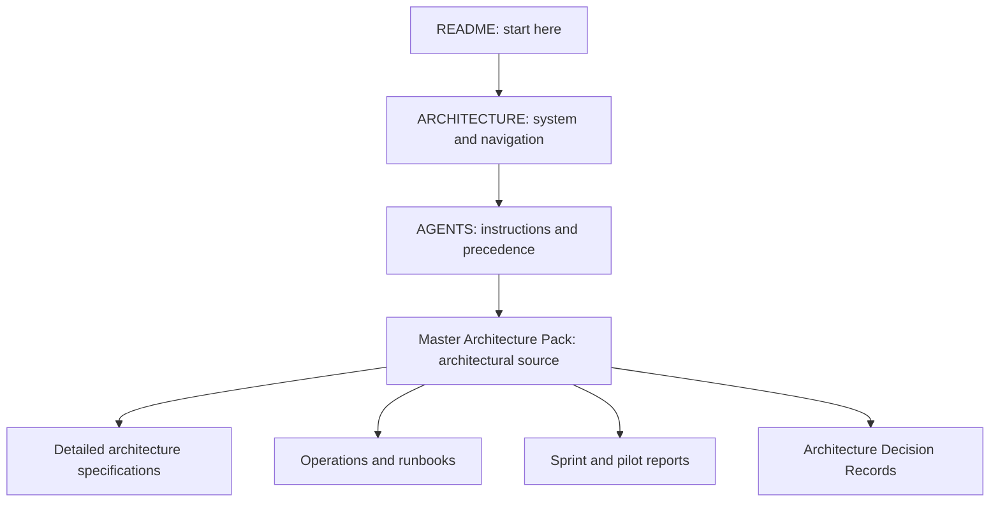

# Architecture

This page is the architectural landing page, not a duplicate specification. The KDP Pipeline is a local-first, audited, AI-assisted authoring and production system. It supports work from concept and planning through bounded chapter drafting, review, verification, manuscript builds, and human release preflight. SQLite is authoritative for operational state; files hold durable artefacts and snapshots. Human approval gates control acceptance, canon changes, release review, and publication.

## Documentation hierarchy

For repository instructions and conflict handling, follow [AGENTS.md](AGENTS.md). The **[KDP Pipeline Master Architecture Pack](KDP_PIPELINE_MASTER_ARCHITECTURE_PACK/README.md)** is the long-term source of architectural decisions. Detailed specifications, operations guides, sprint reports, and pilot reports support it and should link to authoritative material instead of copying it.

If documents conflict, AGENTS.md comes first, then the Master Architecture Pack, then supporting project documentation. Implementation decisions must remain consistent with the pack. Stop and surface unresolved architectural conflicts before implementing dependent changes.

The diagram shows a suggested reading path and navigation branches. It does not change the precedence rules above.

## Where to go

- [Master Architecture Pack](KDP_PIPELINE_MASTER_ARCHITECTURE_PACK/README.md) — long-term architecture overview and package map.
- [Architecture Decision Records](KDP_PIPELINE_MASTER_ARCHITECTURE_PACK/07_Architecture_Decision_Records/) and [DECISIONS.md](DECISIONS.md) — accepted decision records and their index.
- [ROADMAP.md](ROADMAP.md) — completed platform milestones through Sprint 16 and future candidates.
- [v1.0 platform release note](docs/operations/V1_0_PLATFORM_COMPLETE.md) — completed capabilities and operating boundaries.
- [Detailed v1.0 build specification](docs/architecture/KDP_PIPELINE_SYSTEM_ARCHITECTURE_BUILD_SPEC_v1.0.md) — detailed baseline, subordinate to the pack.
- [Architecture index](docs/ARCHITECTURE_INDEX.md) — operational guides, sprint reports, pilot reports, and other architecture references.
- [AI contribution guide](docs/CONTRIBUTING_AI.md) — practical repository workflow for AI contributors.
