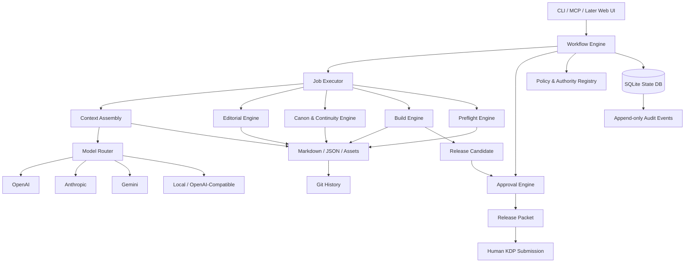
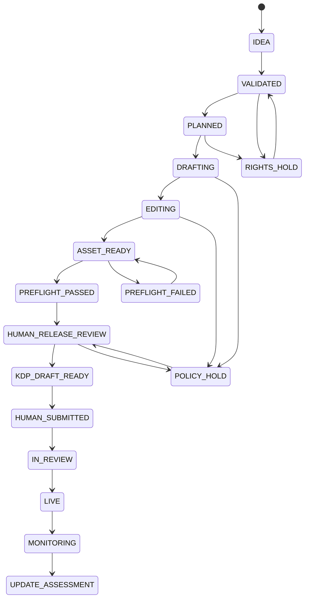
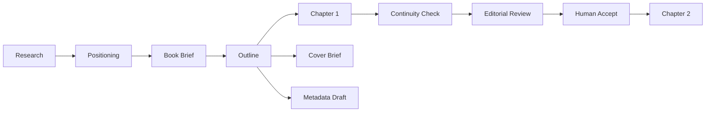

# KDP PIPELINE v1.0
## System Architecture & Build Specification

**Project:** KDP PIPELINE  
**Status:** Canonical architecture baseline for implementation  
**Architecture version:** 1.0  
**First implementation target:** `v0.1 — Authoring Core`  
**Date:** 2026-09-24  
**Operating model:** Local-first, AI-empowered, human-supervised publishing production system

---

## 0. Executive decision

We will build our own KDP authoring and publishing-production system.

We will **not** fork one external repository and make it the product. Instead, we will selectively reuse proven patterns from the research and reference repositories while keeping our own data model, workflow engine, canon controls, provenance model, policy layer, approval gates, and MCP interface.

The initial product is deliberately small:

> Starting from a new project folder, the system must be able to take one book from idea → positioning → series/book architecture → outline → chapter drafting → continuity checking → editorial review → human approval, while retaining a complete provenance and audit trail.

The system will initially stop **before autonomous retailer publication**. KDP account credentials, legal declarations, pricing/territory certifications, Terms acceptance, and the final Publish action remain human-controlled.

---

# 1. Product definition

## 1.1 What we are building

KDP Pipeline is a **local-first, AI-native authoring and publishing-production operating system**.

It coordinates:

- market and reader research
- project/series planning
- structured authoring
- controlled chapter generation
- canon and continuity management
- editorial passes
- rights/provenance records
- cover and packaging briefs
- deterministic manuscript builds
- technical preflight
- metadata preparation
- release packets
- human approval gates
- post-publication learning

It must support fiction and nonfiction without hard-coding one genre.

## 1.2 What we are not building

The initial product is **not**:

- a “one prompt → instant book” generator
- an unattended KDP publishing bot
- a mass-upload system
- an Amazon credential vault
- an ad automation platform
- a SaaS marketplace
- a multi-tenant web application
- a 20-agent swarm
- a genre-specific clone machine

---

# 2. Governing design principles

1. **AI output is not canon by default.**
2. **State lives in the system, not in chat history.**
3. **Small jobs beat giant prompts.**
4. **Human approvals are real workflow states, not decorative checkboxes.**
5. **Policy knowledge has authority and freshness levels.**
6. **Models are replaceable providers, not architectural dependencies.**
7. **Deterministic tools handle deterministic work.**
8. **Every release-relevant asset has provenance.**
9. **Every consequential mutation is auditable.**
10. **The core remains genre-agnostic; genre/series behaviour is configuration.**
11. **KDP submission is a manual release boundary.**
12. **Low-cost local infrastructure first; managed infrastructure only after proven need.**

---

# 3. Reference architecture influences

External projects are references, not dependencies.

| Reference | What we borrow | What we do not copy |
|---|---|---|
| AuthorAgent | Local-first authoring, long-book memory, modular workflows, series/canon ideas | Its entire feature surface |
| writing-template-for-ai | File-native contracts, chapter-per-file discipline, durable memory/handoff patterns | Tool-specific assumptions |
| Built&Written MCP | Persistent project state + MCP interaction model + read/write tool separation | Paid hosted services |
| kindle-book-agency | Dependency-aware DAG, parallel independent jobs, chapter job expansion, DOCX compilation ideas | Claude-only architecture and weak governance |
| kdp-kings-wiki | Skill routing, progressive disclosure, practitioner workflow ideas | Stale policy claims, copied transcript corpus, AI-detector-evasion framing |
| gpt-author / GroqBook / similar | Chained generation and model-role separation | One-shot book generation |
| Official KDP documentation | Policy authority | Static hard-coded assumptions |

---

# 4. High-level system architecture



---

# 5. Technology stack

## 5.1 v0.1 defaults

| Concern | Default |
|---|---|
| Language | Python 3.12+ |
| CLI | Typer |
| Validation | Pydantic |
| State DB | SQLite |
| ORM/query layer | SQLModel or lightweight SQLAlchemy |
| Canonical content | Markdown + JSON |
| Version control | Git |
| Prompt templates | Markdown/Jinja-compatible templates |
| Async execution | `asyncio` |
| HTTP | `httpx` |
| DOCX | `python-docx` |
| EPUB/build | Pandoc initially; direct EPUB tooling only if needed |
| EPUB validation | EPUBCheck |
| Preview | Kindle Previewer + KDP Online Previewer, human-controlled |
| Hashing | SHA-256 |
| Testing | pytest |
| Config | `.env` for API keys + non-secret YAML/JSON config |
| MCP | Python MCP server after core CLI stabilizes |

## 5.2 Explicitly postponed

- PostgreSQL
- Redis
- Celery
- Kubernetes
- vector database as a default dependency
- web dashboard
- cloud asset store
- multi-user RBAC implementation
- billing/subscriptions

These may be added only when the pilot proves the need.

---

# 6. Repository architecture

```text
kdp-pipeline/
├── README.md
├── pyproject.toml
├── .env.example
├── .gitignore
│
├── docs/
│   ├── architecture/
│   ├── decisions/
│   ├── policy/
│   └── research/
│
├── src/kdp_pipeline/
│   ├── cli/
│   ├── core/
│   │   ├── ids.py
│   │   ├── state_machine.py
│   │   ├── events.py
│   │   └── errors.py
│   │
│   ├── storage/
│   │   ├── db.py
│   │   ├── files.py
│   │   ├── hashes.py
│   │   └── manifests.py
│   │
│   ├── models/
│   │   ├── project.py
│   │   ├── title.py
│   │   ├── asset.py
│   │   ├── provenance.py
│   │   ├── rights.py
│   │   ├── canon.py
│   │   ├── editorial.py
│   │   ├── approval.py
│   │   ├── job.py
│   │   └── release.py
│   │
│   ├── providers/
│   │   ├── base.py
│   │   ├── openai.py
│   │   ├── anthropic.py
│   │   ├── gemini.py
│   │   └── openai_compatible.py
│   │
│   ├── prompts/
│   │   ├── registry.py
│   │   └── renderer.py
│   │
│   ├── context/
│   │   ├── assembler.py
│   │   ├── budgets.py
│   │   └── selectors.py
│   │
│   ├── workflows/
│   │   ├── engine.py
│   │   ├── definitions.py
│   │   └── transitions.py
│   │
│   ├── jobs/
│   │   ├── runner.py
│   │   ├── queue.py
│   │   └── handlers/
│   │
│   ├── authoring/
│   │   ├── positioning.py
│   │   ├── series.py
│   │   ├── outline.py
│   │   └── drafting.py
│   │
│   ├── continuity/
│   │   ├── ledger.py
│   │   ├── proposals.py
│   │   └── validator.py
│   │
│   ├── editorial/
│   │   ├── developmental.py
│   │   ├── voice.py
│   │   ├── continuity.py
│   │   ├── line.py
│   │   ├── copy.py
│   │   └── fact_rights.py
│   │
│   ├── policy/
│   │   ├── authority.py
│   │   ├── registry.py
│   │   └── freshness.py
│   │
│   ├── build/
│   │   ├── docx.py
│   │   ├── epub.py
│   │   ├── metadata.py
│   │   └── release_packet.py
│   │
│   ├── preflight/
│   │   ├── rules.py
│   │   ├── epub.py
│   │   ├── metadata.py
│   │   └── provenance.py
│   │
│   └── mcp/
│       └── server.py
│
├── prompts/
│   ├── planning/
│   ├── drafting/
│   ├── continuity/
│   ├── editorial/
│   └── packaging/
│
├── templates/
│   ├── project/
│   ├── series-bible/
│   ├── series-engine/
│   ├── style-card/
│   ├── book-brief/
│   ├── chapter-card/
│   └── release-packet/
│
├── projects/
│   └── .gitkeep
│
└── tests/
    ├── unit/
    ├── integration/
    └── fixtures/
```

---

# 7. Project workspace layout

Each project is a durable workspace.

```text
projects/{project_id}/
├── project.json
├── series/
│   ├── series-bible.md
│   ├── series-engine.md
│   ├── style-card.md
│   └── visual-system.md
│
├── titles/{title_id}/
│   ├── 00_admin/
│   ├── 01_research/
│   ├── 02_sources/
│   ├── 03_rights/
│   ├── 04_plan/
│   │   ├── positioning.md
│   │   ├── book-brief.md
│   │   ├── outline.md
│   │   └── chapter-cards/
│   ├── 05_drafts/
│   │   ├── experimental/
│   │   └── accepted/
│   ├── 06_canon/
│   │   ├── continuity-ledger.json
│   │   ├── entities.json
│   │   └── unresolved.json
│   ├── 07_editorial/
│   ├── 08_art/
│   ├── 09_build/
│   ├── 10_qa/
│   ├── 11_release/
│   └── 12_archive/
```

---

# 8. Canonical data model

## 8.1 Core entities

### Project

```text
project_id
name
created_at
status
default_language
default_provider_policy
```

### Series

```text
series_id
project_id
name
series_bible_version
series_engine_version
style_card_version
visual_system_version
```

### Title

```text
title_id
project_id
series_id?
working_title
final_title?
subtitle?
volume?
edition
language
format_targets
status
target_reader
created_at
```

### Asset

```text
asset_id
title_id
type
path
version
sha256
creator_type
creator
source_ref?
ai_classification
approval_status
created_at
```

### ProvenanceRecord

```text
provenance_id
asset_id
job_id?
provider
model
prompt_template_id
prompt_template_version
input_asset_ids
input_hashes
output_hash
generation_timestamp
human_contribution_note
ai_classification
disclosure_decision
reviewer?
```

### RightsRecord

```text
rights_id
asset_id
owner
legal_basis
territories
languages
formats
term
restrictions
evidence_path
review_status
reviewer
```

### EditorialFinding

```text
finding_id
title_id
asset_id
pass_type
severity
location
description
evidence
recommended_action
status
owner
resolution
```

### Approval

```text
approval_id
title_id
scope
candidate_hash
approver
decision
policy_baseline_version
conditions
created_at
expires_at?
```

### Job

```text
job_id
title_id
job_type
status
idempotency_key
input_manifest_hash
provider?
model?
started_at?
completed_at?
result_asset_ids
error?
```

### ReleaseCandidate

```text
candidate_id
title_id
manuscript_hash
cover_hash?
ebook_hash?
metadata_hash
policy_baseline_version
preflight_report_id
approval_ids
created_at
frozen
```

### AuditEvent

Append-only.

```text
event_id
timestamp_utc
actor_type
actor_id
action
entity_type
entity_id
before_hash?
after_hash?
correlation_id
result
metadata
```

---

# 9. Title state machine



## 9.1 Hard rule

The following states block automation from advancing:

- `RIGHTS_HOLD`
- `POLICY_HOLD`
- `PREFLIGHT_FAILED`
- `KDP_EXCEPTION`

There is no global “ignore all warnings” command.

---

# 10. Workflow engine

## 10.1 Job model

The workflow engine runs small restartable jobs.

Examples:

```text
create_project
validate_idea
build_positioning
create_series_bible
create_book_brief
generate_outline
draft_chapter
analyze_continuity
propose_canon_update
run_developmental_edit
run_voice_edit
run_line_edit
run_copy_edit
build_docx
build_epub
run_preflight
freeze_release_candidate
prepare_release_packet
```

## 10.2 Job statuses

```text
queued
running
success
failed
needs_human
retryable
cancelled
```

## 10.3 Idempotency

Every job receives an idempotency key:

```text
{job_type}:{input_manifest_hash}:{ruleset_version}
```

If an identical successful job exists, return that result instead of duplicating work.

## 10.4 Retry policy

Automatic retry is allowed only for transient technical failures:

- API timeout
- rate limit
- network failure
- temporary file/storage error

Automatic retry is forbidden for:

- policy failures
- rights failures
- quality failures
- missing approvals
- failed preflight assertions

---

# 11. DAG execution and parallelism

The workflow engine supports dependency-aware DAGs.



Parallelism is allowed when tasks do not mutate shared canon or depend on unresolved narrative state.

### Safe parallel candidates
- cover brief vs manuscript drafting
- metadata draft vs late-stage copy pass
- independent technical scans
- independent editorial analyses

### Unsafe-by-default parallel candidates
- sequential fiction chapters
- canon-changing operations
- continuity updates
- release-candidate mutations

---

# 12. AI provider abstraction

## 12.1 Provider contract

```python
class ModelProvider(Protocol):
    async def generate(self, request: GenerationRequest) -> GenerationResult: ...
```

`GenerationRequest` contains:

```text
task_type
system_instructions
prompt
attachments/context
max_output_tokens
temperature
structured_output_schema?
```

`GenerationResult` contains:

```text
provider
model
text
structured_data?
usage
latency
raw_response_ref?
```

## 12.2 Model routing policy

Routing is task-based, not brand-based.

```text
planning / deep editorial       -> strongest reasoning model
chapter drafting                -> strong prose model
classification / extraction     -> cheaper fast model
deterministic validation        -> no LLM
cover concept generation        -> image model only when needed
```

## 12.3 Budget control

Each job may define:

```text
max_cost
preferred_provider
fallback_providers
max_retries
quality_tier
```

The system logs estimated and actual model usage where APIs expose it.

---

# 13. Prompt architecture

Prompts are versioned assets.

```text
prompts/
  drafting/
    chapter-draft-v1.0.md
    chapter-draft-v1.1.md
  editorial/
    developmental-v1.0.md
```

Every prompt execution records:

```text
template ID
template version
rendered prompt hash
input asset IDs
input hashes
provider/model
output asset ID
```

Prompts must instruct the model to:

- use only approved context for factual claims
- mark missing evidence rather than invent it
- distinguish proposal from canon
- return structured issues when performing QA
- avoid silently modifying canonical facts

---

# 14. Context assembly

Context assembly is a first-class subsystem.

A chapter-writing call should not receive the entire project indiscriminately.

## 14.1 Context tiers

### Tier A — Always-on compact context
- title/book brief
- POV/voice rules
- current chapter card
- essential series rules
- critical canon constraints

### Tier B — Relevant retrieved context
- involved characters
- involved locations
- unresolved continuity items
- previous chapter summary
- relevant world rules

### Tier C — Archival lookups
- full prior chapters
- research source excerpts
- older continuity records

## 14.2 Context manifest

Every AI job stores the exact context manifest used.

This makes generations reproducible and debuggable.

---

# 15. Canon and continuity system

## 15.1 Canon rule

```text
AI OUTPUT != CANON
```

A model may create a `CanonProposal`, never silently mutate canonical records.

## 15.2 CanonProposal

```text
proposal_id
title_id
entity_id
field
current_value
proposed_value
reason
evidence_asset_ids
affected_assets
status
```

Status:

```text
proposed
accepted
rejected
superseded
```

## 15.3 Continuity ledger

Tracks at minimum:

- characters
- names/aliases
- relationships
- ages/dates
- locations
- chronology
- injuries/status
- knowledge state (“who knows what?”)
- world rules
- unresolved questions
- object status
- series-level carryover

## 15.4 Chapter acceptance sequence

```text
draft
  ↓
continuity analysis
  ↓
editorial findings
  ↓
revision
  ↓
human acceptance
  ↓
canon update proposal
  ↓
canon approval
  ↓
accepted chapter
```

---

# 16. Experimental vs canonical zones

## Experimental
AI-generated proposals and drafts.

May be overwritten or discarded.

## Canonical
Human-accepted project state.

Cannot be silently replaced.

```text
05_drafts/experimental/
05_drafts/accepted/
06_canon/
```

Any move from experimental to accepted records:

- source asset
- destination asset
- hashes
- reviewer
- approval
- timestamp
- provenance inheritance

---

# 17. Editorial pipeline

Distinct passes remain separate.

1. **Developmental**
   - structure
   - pacing
   - missing beats
   - chapter purpose
   - earned climax/resolution

2. **Voice**
   - character/narrator consistency
   - style-card violations
   - generic AI cadence
   - unwanted modernisms/clichés where relevant

3. **Continuity**
   - timeline
   - names
   - objects
   - knowledge states
   - world rules

4. **Line**
   - clarity
   - rhythm
   - repetition
   - filter words
   - paragraph flow

5. **Copy**
   - grammar
   - punctuation
   - capitalization
   - scene breaks
   - consistency

6. **Fact/Rights**
   - unsupported claims
   - quotations
   - trademarks
   - third-party material
   - permissions
   - high-risk factual assertions

Each pass produces **findings**, not an opaque replacement manuscript.

---

# 18. Policy and knowledge authority layer

## 18.1 Authority hierarchy

```text
Tier 1 — Official authority
Amazon KDP Help
Amazon KDP Terms
Amazon Ads official documentation
Official technical specifications

Tier 2 — Verified internal research
Our checked policy summaries
Current marketplace observations

Tier 3 — Practitioner knowledge
Kindlepreneur
Experienced publishers
KDP Kings-style frameworks
Case studies

Tier 4 — Inspiration
GitHub repos
Blogs
Videos
Prompt collections
```

Lower tiers cannot override higher tiers.

## 18.2 PolicyRule object

```text
rule_id
topic
value
authority_tier
source_title
source_url
checked_at
reviewer
valid_from?
valid_until?
recheck_required
supersedes_rule_id?
notes
```

## 18.3 Freshness rule

Any release-sensitive policy rule must be rechecked before:

- first publication
- republish/material update
- pricing changes
- KDP Select decisions
- preorder actions
- rights/territory declarations
- AI disclosure decisions
- advertising submission

Static repository notes are never treated as permanent KDP truth.

---

# 19. Provenance system

Provenance exists from the first generation.

Every generated asset records:

- who/what created it
- model/provider/version when available
- prompt template/version
- exact input manifest
- output hash
- human edits/acceptance
- AI-generated vs AI-assisted classification
- disclosure decision
- downstream assets derived from it

This supports:

- auditability
- debugging
- release disclosure
- rights questions
- reproducibility
- model comparison
- future migration

---

# 20. Rights system

Every release-relevant third-party asset should have an explicit rights state.

Possible states:

```text
owned
licensed
permission_granted
public_domain_verified
fair_use_legal_review
unresolved
prohibited
```

`unresolved` or `prohibited` blocks release.

The system does not make final legal conclusions autonomously.

---

# 21. Build pipeline

## 21.1 Source manuscript

Accepted chapter files remain canonical source.

```text
accepted/chapter-01.md
accepted/chapter-02.md
...
```

## 21.2 Build outputs

```text
09_build/
  manuscript.docx
  manuscript.epub
  metadata.json
  build-manifest.json
```

## 21.3 Build manifest

```text
build_id
title_id
source_asset_hashes
tool_versions
build_timestamp
output_hashes
```

Builds must be reproducible from accepted source state.

---

# 22. Preflight engine

Preflight should be as deterministic as possible.

## 22.1 Initial checks

### Identity/metadata consistency
- title
- subtitle
- author
- series
- volume
- edition
- language

### Manuscript
- missing chapters
- duplicate chapters
- placeholders
- empty headings
- broken internal references
- unexpected files

### EPUB
- EPUBCheck
- navigation
- language metadata
- title metadata
- broken links
- image formats
- alt text presence where required

### Provenance
- all release assets registered
- disclosure decision exists
- required rights records exist

### Release integrity
- hashes match approved candidate
- no file changed after approval

## 22.2 Result

```text
passed
failed
needs_human
```

A failed preflight cannot be overridden by a blanket switch.

---

# 23. Human approval gates

| Gate | Human decision |
|---|---|
| G0 | Operating readiness |
| G1 | Idea/positioning |
| G2 | Rights plan |
| G3 | Outline/content plan |
| G4 | Manuscript completeness |
| G5 | Editorial sign-off |
| G6 | Asset/design sign-off |
| G7 | Release candidate acceptance |
| G8 | KDP authorization |
| G9 | Change/update authorization |

v0.1 implements G1-G5 first.

---

# 24. Release candidate immutability

When a release candidate is frozen:

```text
manuscript hash
cover hash
EPUB/DOCX hash
metadata hash
policy baseline version
preflight report
approval bindings
```

are locked together.

Any change creates a **new candidate** and invalidates approvals whose scope depended on changed data.

---

# 25. Release packet

The system prepares, but does not submit, a human-readable release packet containing:

```text
title ID / edition / language / format
candidate hashes
policy baseline
AI/provenance classification
rights summary
editorial approvals
accessibility/preview evidence
exact metadata
keywords/categories draft
pricing decision record
KDP Select decision record
preorder decision record
exceptions
approvers
```

---

# 26. Security boundary

Never store in project workspaces or prompts:

- KDP password
- one-time codes
- tax IDs
- government ID images
- banking credentials
- sensitive account-recovery information

API keys live in environment variables or a secret manager.

AI workers never receive KDP credentials.

---

# 27. CLI contract

Initial commands:

```bash
kdp init-project
kdp new-title

kdp positioning create TITLE_ID
kdp series init PROJECT_ID
kdp brief create TITLE_ID
kdp outline generate TITLE_ID

kdp chapter draft TITLE_ID 1
kdp chapter continuity TITLE_ID 1
kdp editorial run TITLE_ID 1 --pass developmental
kdp chapter revise TITLE_ID 1
kdp chapter accept TITLE_ID 1

kdp canon list TITLE_ID
kdp canon proposals TITLE_ID
kdp canon approve TITLE_ID PROPOSAL_ID

kdp status TITLE_ID
kdp jobs TITLE_ID
kdp audit TITLE_ID

# later
kdp build docx TITLE_ID
kdp build epub TITLE_ID
kdp preflight TITLE_ID
kdp release freeze TITLE_ID
kdp release packet TITLE_ID
```

---

# 28. MCP interface design

MCP comes after the CLI/core is stable.

## Read tools

```text
list_projects
get_project
get_title
get_series_bible
get_series_engine
get_book_brief
get_outline
get_chapter
get_continuity
get_editorial_findings
get_job
get_release_candidate
```

## Proposal/generation tools

```text
create_positioning_proposal
create_book_brief_proposal
generate_outline_proposal
draft_chapter
analyze_continuity
propose_canon_update
run_editorial_pass
generate_cover_brief
draft_metadata
```

## Controlled mutation tools

```text
accept_chapter
resolve_editorial_finding
approve_canon_proposal
register_asset
register_rights_record
```

## Build/preflight tools

```text
build_docx
build_epub
run_preflight
freeze_release_candidate
prepare_release_packet
```

## Explicitly absent

```text
publish_to_kdp
accept_kdp_terms
set_worldwide_rights
enable_kdp_select
change_live_price
submit_ad_campaign
```

---

# 29. v0.1 — Authoring Core

## Goal

Prove the architecture with one complete chapter lifecycle.

## Required workflow

```text
NEW PROJECT
→ IDEA/POSITIONING
→ SERIES/BIBLE OR STANDALONE BOOK CONTEXT
→ BOOK BRIEF
→ OUTLINE
→ CHAPTER CARD
→ DRAFT CHAPTER 1
→ CONTINUITY ANALYSIS
→ EDITORIAL REVIEW
→ REVISION
→ HUMAN ACCEPTANCE
→ CANON UPDATE
→ AUDIT/PROVENANCE VERIFIED
```

## Not required in v0.1

- EPUB
- cover generation
- KDP metadata optimization
- ads
- MCP
- web UI
- multi-user collaboration
- automated market scraping

---

# 30. v0.1 implementation backlog

## Sprint 1 — Foundation

- [ ] Initialize repository
- [ ] Configure Python project and tests
- [ ] Create SQLite DB
- [ ] Implement IDs
- [ ] Implement core Pydantic models
- [ ] Implement project/title workspace creation
- [ ] Implement asset hashing
- [ ] Implement append-only audit event writer
- [ ] Implement CLI skeleton

**Exit condition:** A project and title can be created and fully represented on disk + DB.

## Sprint 2 — Provider + prompts

- [ ] `ModelProvider` protocol
- [ ] One primary provider adapter
- [ ] Second provider adapter
- [ ] prompt registry
- [ ] prompt versioning
- [ ] generation job record
- [ ] provenance record creation
- [ ] context manifest

**Exit condition:** A versioned AI job can run and produce a traceable experimental asset.

## Sprint 3 — Planning pipeline

- [ ] positioning template
- [ ] series bible template
- [ ] series engine template
- [ ] style card template
- [ ] book brief template
- [ ] outline generator
- [ ] chapter card generator
- [ ] human acceptance command

**Exit condition:** One title reaches `PLANNED`.

## Sprint 4 — Chapter lifecycle

- [ ] chapter draft job
- [ ] continuity analysis
- [ ] developmental editorial pass
- [ ] revision job
- [ ] accepted chapter state
- [ ] canon proposal
- [ ] canon approval

**Exit condition:** One chapter moves from experimental draft to accepted canon with full history.

## Sprint 5 — Robustness

- [ ] idempotency keys
- [ ] retry policy
- [ ] failed/needs-human handling
- [ ] state-transition validation
- [ ] audit command
- [ ] job inspection
- [ ] fixture project
- [ ] integration tests

**Exit condition:** Re-running commands does not corrupt state or duplicate canonical assets.

---

# 31. v0.1 acceptance tests

The build passes only if all are true:

1. A project/title can be created without hand-editing internal DB rows.
2. A title cannot jump illegally from `IDEA` to `DRAFTING`.
3. A prompt execution records model, prompt version, inputs, output and hashes.
4. A generated chapter lands in the experimental zone.
5. A continuity check can identify proposed canon changes without mutating canon.
6. Editorial findings are stored separately from revised prose.
7. Human acceptance is required before a chapter becomes canonical.
8. Canon changes require explicit approval.
9. Re-running the same idempotent job does not duplicate accepted state.
10. An audit view can explain how the accepted chapter was created.
11. The system can switch model provider without changing workflow definitions.
12. The project still works if the original chat conversation disappears.

---

# 32. Testing strategy

## Unit
- ID generation
- hashes
- state transitions
- context selectors
- policy precedence
- prompt rendering
- canon proposals

## Integration
- project → title → planning
- draft → editorial → accept
- failed job retry
- illegal transition rejection
- provider fallback
- provenance inheritance

## Golden fixtures
Maintain one tiny fictional sample project and one tiny nonfiction project.

They are used to test architecture, not quality benchmarking.

## Manual quality review
Human review remains required for:
- prose quality
- narrative coherence
- voice
- reader value
- rights ambiguity
- release readiness

---

# 33. Cost-control strategy

1. Use deterministic code instead of LLMs whenever possible.
2. Use expensive reasoning models only where reasoning materially improves output.
3. Use cheaper models for extraction/classification.
4. Cache successful idempotent jobs.
5. Reuse compact accepted summaries instead of resending whole manuscripts.
6. Store token/usage metadata.
7. Allow per-project budget caps later.
8. Prefer local/open models for non-critical low-risk tasks when quality is sufficient.

---

# 34. Pilot methodology

The first pilot is not judged by speed.

We are testing:

- state integrity
- continuity integrity
- context quality
- editorial usefulness
- provenance completeness
- human control
- model interchangeability
- failure recovery

After the first complete book we review:

```text
What required too much manual work?
What did the AI repeatedly get wrong?
Which context was missing?
Which prompts were too generic?
Which state transitions were awkward?
Which jobs can safely automate further?
Which steps should remain manual?
```

Only then do we automate more.

---

# 35. Roadmap after v0.1

## v0.2 — Full Manuscript
- multi-chapter lifecycle
- compact chapter summaries
- cross-book continuity
- editorial batch runs
- cost tracking

## v0.3 — Publishing Package
- DOCX
- EPUB
- metadata pack
- cover brief
- deterministic preflight
- release candidate freeze
- release packet

## v0.4 — MCP
- expose stable core through MCP
- ChatGPT/Claude/Codex/Gemini-compatible operation
- read/propose/write/approve/build tool separation

## v0.5 — Policy Intelligence
- official-source refresh workflow
- policy rule registry
- freshness alerts
- KDP release checklist generation

## v0.6 — Operator Workspace
Only if CLI + MCP prove insufficient:
- local web UI
- job dashboard
- findings/approval review
- release-candidate viewer

---

# 36. Architecture decisions frozen for v0.1

The following are now defaults unless implementation evidence forces a change:

- Python core
- local-first
- SQLite state
- Markdown/JSON canonical content
- Git history
- title IDs and asset IDs
- experimental vs canonical separation
- explicit state machine
- append-only audit events
- provenance from first generation
- proposal-based canon updates
- distinct editorial passes
- replaceable model providers
- DAG-capable job engine
- human approval gates
- no KDP credentials
- no autonomous publication
- MCP after CLI/core stability
- no web UI in v0.1

---

# 37. Immediate implementation sequence

The next engineering action is no longer more research.

It is:

```text
1. Create repository
2. Scaffold package structure
3. Implement Project / Title / Asset / Job / AuditEvent
4. Implement SQLite + workspace creation
5. Implement state machine
6. Implement CLI
7. Implement first model provider
8. Implement prompt/provenance pipeline
9. Implement planning artefacts
10. Implement one-chapter vertical slice
```

When that works, we have the first real KDP Pipeline product.

---

# Appendix A — Core invariants

These rules should be enforceable in code.

```text
INV-001: No experimental asset is canonical without an acceptance event.
INV-002: No canon mutation occurs without an approved CanonProposal.
INV-003: No accepted asset exists without provenance.
INV-004: No frozen release candidate can be overwritten.
INV-005: Changing a frozen candidate creates a new candidate.
INV-006: A policy/rights failure cannot auto-retry into success.
INV-007: Every job has an idempotency key.
INV-008: Every state change emits an audit event.
INV-009: Model providers cannot directly mutate workflow state.
INV-010: AI workers never receive KDP credentials.
INV-011: Lower-authority knowledge cannot override official policy.
INV-012: The final KDP Publish action is outside autonomous tooling.
```

---

# Appendix B — First vertical-slice scenario

**Scenario:** Create Chapter 1 of a new original fiction title.

```text
$ kdp init-project
→ PRJ-0001

$ kdp new-title
→ BK-0001 / state=IDEA

$ kdp positioning create BK-0001
→ proposal created
→ human accepts
→ state=VALIDATED

$ kdp brief create BK-0001
→ book brief proposal
→ human accepts

$ kdp outline generate BK-0001
→ outline proposal
→ human accepts
→ state=PLANNED

$ kdp chapter draft BK-0001 1
→ JOB-0001
→ experimental/chapter-01-v0.1.md
→ provenance recorded

$ kdp chapter continuity BK-0001 1
→ findings + canon proposals

$ kdp editorial run BK-0001 1 --pass developmental
→ editorial findings

$ kdp chapter revise BK-0001 1
→ experimental/chapter-01-v0.2.md

$ kdp chapter accept BK-0001 1
→ accepted/chapter-01-v1.0.md
→ acceptance event

$ kdp canon approve BK-0001 CP-0001
→ continuity ledger updated
→ audit event
```

At that point the vertical slice is successful.

---

# Appendix C — Research baseline retained

The architecture above was synthesized from the project research package, including:

- original KDP pipeline artefacts and research reports
- compliance-first AI authoring implementation guide
- AI authoring repository survey
- AuthorAgent
- writing-template-for-ai
- Built&Written MCP/Claude workflow pattern
- kindle-book-agency
- kdp-kings-wiki
- classic generator references such as gpt-author / GroqBook
- official KDP guidance as the required policy authority

These sources remain research references. This document becomes the implementation source of truth.
