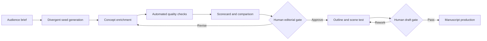

# Idea Development for a Youth-Book KDP Pipeline

## Purpose

This guide turns audience understanding into a repeatable **idea → validation → draft brief** process for an automated ebook pipeline. It covers three practical readership bands:

1. **Children** — a broad market, so the pipeline must split it into precise reading stages.
2. **Teen readers** — generally the publishing market called **Young Adult (YA)**, approximately ages 13–17.
3. **Emerging adults (18–25)** — often called **New Adult (NA)** or adult crossover. This is *not* the same as the publishing term “Young Adult.”

> **Important terminology:** In trade publishing, *Young Adult* typically means books for teens, not books for people in their early twenties. Use explicit age bands in the pipeline rather than relying on labels alone.

A good pipeline does not begin with “write a book about dragons.” It begins with a defined reader and a promise:

> **For this reader, this book will create this emotional experience, through this type of story, in a form they can comfortably read.**

For every book, retain a human editorial gate. Automation can expand options and create disciplined briefs; it should not be the final judge of originality, emotional truth, suitability, factual accuracy, or publishing readiness.

---

## 1. Adopt a reader-first concept model

Represent every candidate concept using this formula:

```text
Reader + emotional need + story engine + distinctive lens + reading format = concept promise
```

| Component | Question to answer | Example (children, 6–8) |
|---|---|---|
| Reader | Who exactly is this for? | Independent readers who like funny school stories |
| Emotional need | What feeling or developmental tension is present? | Wanting to belong without pretending to be someone else |
| Story engine | What repeatedly creates scenes and complications? | A child must hide that the class pet can predict tiny disasters |
| Distinctive lens | What makes the familiar idea feel fresh? | Predictions arrive as rhyming clues from the pet turtle |
| Reading format | What length, vocabulary, and page rhythm fit? | Illustrated early chapter book; short chapters, 7–10k words |

**Resulting promise:** A funny early chapter-book mystery about a child learning to be honest while interpreting a fortune-telling turtle’s unhelpful rhymes.

This keeps an idea from being merely a topic. “Friendship” is a topic. “A new student joins a secret lunchtime club whose rules prevent anyone from admitting they feel lonely” is a story engine with a human truth.

---

## 2. Segment children’s books before generating ideas

“Children’s books” is too large a category for a single generation prompt. A preschool picture book and a middle-grade adventure require different protagonist agency, plot density, language, format, and buying audience.

| Reader stage | Typical age | What the reader needs from the book | Useful story forms | Indicative drafting range* |
|---|---:|---|---|---:|
| Board / read-aloud | 0–3 | Rhythm, naming, repetition, reassurance, caregiver connection | Routine, discovery, playful naming | 100–300 words |
| Picture book | 3–7 | Emotional clarity, visual surprise, satisfying read-aloud rhythm | One strong problem; escalating attempts; circular ending | 300–900 words |
| Early reader | 5–8 | Growing independence, decoding confidence, humor, clear consequences | Episodic problem-solving; school, family, animal, gentle mystery | 500–2,500 words |
| Early chapter book | 6–9 | Competence, friendship, belonging, serial familiarity | Short-chapter adventures, club stories, light mysteries | 4,000–12,000 words |
| Middle grade | 8–12 | Agency, fairness, friendship change, curiosity, adventure | Mystery, fantasy, sports, historical, school/community adventure | 20,000–55,000 words |

\*Ranges are planning aids, not rules. Confirm the current expectations of the specific comparable books and your intended format before commissioning artwork or finalizing a manuscript.

### Children’s-book idea filters

A children’s concept is stronger when it has:

- **A child-sized problem:** A concern the protagonist can meaningfully act on now.
- **Visible cause and effect:** The reader can follow what happens because of each choice.
- **A concrete world:** A classroom, family ritual, neighborhood, animal friend, imaginary rule, or object they can picture.
- **An active young protagonist:** Adults may help, but do not solve the central problem for the child.
- **One emotional through-line:** For example, fear of change, feeling overlooked, jealousy, curiosity, or making amends.
- **Age-fit humor and hope:** The outcome can be bittersweet, but the reader should be emotionally held.

### Reliable children’s-book idea engines

1. **Routine disruption** — A familiar ritual changes: bedtime, a school trip, cooking with a grandparent, losing a favorite object.
2. **Secret rule** — One unusual rule governs an ordinary place: the library books whisper after sunset; only siblings can hear the garden.
3. **Competence wish** — A child wants to do something “big” and discovers a more meaningful way to succeed.
4. **Friendship mismatch** — Two characters want the same friendship but have clashing ways of showing care.
5. **Object with limitations** — A magical object helps, but only in inconvenient or funny ways.
6. **Small mystery, real stakes** — Something important to the child disappears, changes, or seems impossible.
7. **Community contribution** — The child notices a need and mobilizes a modest, plausible solution.

### Seed examples (not titles)

| Age band | Concept seed | Why it can work |
|---|---|---|
| 3–6 | Every night, a child’s mismatched socks leave the drawer to practice a dance for the next day. The child must help the shy single sock join in. | Repetition, visual humor, belonging, a clear bedtime frame |
| 5–8 | A reluctant helper at the school garden discovers that the plants respond to compliments—but each plant has a different personality. | Episodic scenes, gentle humor, confidence through action |
| 7–9 | The new hall monitor can hear lost objects argue about who mislaid them and must solve a school mystery before the talent show. | Clear recurring engine, short mysteries, child agency |
| 8–12 | A town’s annual map-making contest reveals a neighborhood that appears only when its young cartographers disagree. | Adventure plus friendship conflict; premise supports a longer plot |

### Picture-book structure that automation can test

For a picture-book candidate, generate a 12–16 beat outline rather than a full manuscript immediately:

1. Establish the child’s ordinary world and want.
2. Introduce the inciting surprise.
3. Make the first simple attempt fail or complicate the problem.
4. Escalate through varied attempts, leaving room for visual storytelling.
5. Force a meaningful choice, not just a lucky solution.
6. Resolve the emotional problem and echo the opening image, phrase, or routine.

Ask the pipeline to identify whether every beat can be **shown**, not only explained. Illustration-dependent storytelling is a feature of a picture book, not missing prose.

---

## 3. Develop ideas for teens (YA, roughly 13–17)

Teen readers often want heightened experience, but they can detect a story that treats them as younger children. The strongest ideas respect their intelligence and take emotional consequences seriously.

### Core tensions to explore

These are starting points, not boxes every teen lives in:

- Identity versus expectation
- Belonging versus self-protection
- First independence versus dependence on family/community
- Friendship loyalty versus changing values
- Desire and attraction versus reputation, boundaries, or safety
- Individual agency versus institutions, tradition, or systems
- Moral certainty versus a complicated truth
- Being seen versus having privacy

### YA concept filters

| Element | Strong default |
|---|---|
| Protagonist | A teen whose choices drive the plot; usually close to the intended reader’s age |
| Stakes | Social, emotional, family, academic, community, or existential—felt immediately and specifically |
| Voice | Direct, contemporary or deliberately stylized; emotionally precise rather than patronizing |
| Plot | A problem that grows as choices create costs; not a chain of events adults resolve |
| Relationships | Friendships, family, rivalries, and/or romance with agency, boundaries, and consequences |
| Theme | Emerges from pressure on the protagonist; does not arrive as a lecture |

### High-yield YA idea engines

1. **A public role with a private cost** — Student leader, athlete, creator, activist, caregiver, heir, trainee.
2. **A system that selects or sorts people** — An academy, competition, town tradition, algorithm, magical test, club, or workplace.
3. **A promise with a deadline** — A secret must be kept until graduation, a sibling must be protected through a season, an event must be prevented.
4. **A relationship under pressure** — A friendship, family bond, rivalry, or romance changes when the characters want incompatible things.
5. **An inherited story challenged by evidence** — A family myth, local legend, historical account, or public reputation begins to break.
6. **Competence in a surprising arena** — Restoration, coding, music, urban gardening, debate, esports, fishing, robotics, dance, emergency volunteering—used as an actual plot arena rather than decorative research.

### Seed examples (not titles)

| Story lane | Concept seed | Central question |
|---|---|---|
| Contemporary mystery | After a viral video falsely identifies her brother as a thief, a teen archivist discovers that the town’s public records were manipulated. | What do you owe the truth when telling it might hurt your own family? |
| Romantic fantasy | A trainee translator discovers that every treaty she translates alters one memory in the minds of both nations. | Can intimacy survive when memory itself is political? |
| Speculative thriller | Students earn school privileges by donating “unproductive” dreams to an education platform; a group notices their ambitions are becoming identical. | Who profits when young people stop imagining differently? |
| Sports / friendship | A talented reserve on a community team must choose whether to reveal a coach’s manipulation after it finally earns her playing time. | Is belonging worth participating in unfairness? |

### Keeping YA authentic without trend-chasing

- Start with a durable emotional tension, not a social-media microtrend.
- Read recent books in the actual subgenre to understand **voice, pacing, cover signaling, and reader expectations**.
- Build specificity from respectful research or lived knowledge—not stereotypes, borrowed trauma, or “issue of the week” plots.
- Make the premise legible in one sentence, then give it a second layer: a contradiction, moral cost, or unexpected relationship.
- Keep the teen protagonist at the center of interpretation and action, even when the world contains powerful adults.

---

## 4. Develop ideas for emerging adults (18–25 / New Adult / crossover)

Books for readers entering adult independence can address freedom, ambiguity, intimacy, career direction, living arrangements, financial pressure, and changing family roles. The label **New Adult** is used inconsistently across retailers and publishers, so focus your metadata and positioning on the actual genre, theme, heat level, and content rather than assuming the label alone will find readers.

### Core tensions to explore

- Building a life rather than selecting one
- Financial and practical independence
- Changing friendships after school or home
- First adult work, study, artistic, or caregiving responsibilities
- Dating, commitment, boundaries, and self-knowledge
- Leaving, returning to, or reinterpreting home/community
- Discovering that competence does not remove uncertainty

### Concept filters for this band

- The protagonist has **material agency**: housing, work, university/training, travel, caregiving, creative goals, or other adult-level responsibilities.
- The plot includes costs that cannot be fixed by a parent, a single apology, or a convenient windfall.
- Relationships are mutual, with clearly considered consent and power dynamics.
- The positioning is candid about genre and content expectations. A cover, blurb, and category should not imply a sweeter or younger book than it is.

### Seed examples (not titles)

| Story lane | Concept seed | Emotional promise |
|---|---|---|
| Contemporary romance | Two underemployed roommates enter a local business pitch contest using a fake “professional partnership,” then learn their goals require different cities. | Romantic tension paired with choosing an adult future |
| Fantasy | A first-year city planner discovers the neglected neighborhoods on her map are physically disappearing from official memory. | Ambition, responsibility, and systemic stakes |
| Literary / family | A returning graduate takes a temporary job cataloguing a grandmother’s workshop and finds records that recast a family’s proud origin story. | Homecoming, identity, and inherited narrative |
| Thriller | A junior cybersecurity worker traces a series of identity thefts to a mutual-aid group that once helped her survive eviction. | Loyalty, survival, and ethical compromise |

---

## 5. Use a structured concept-generation session

The aim is **divergence first, judgment second**. Do not ask an AI or an editor to rank concepts before enough raw material exists.

### Step 1: Create an audience brief

Make each brief specific enough to exclude most ideas.

```text
Age / reading stage: 8–10, middle-grade readers
Reading context: independent reading; high-energy weekend and school-library audience
Emotional territory: wanting to matter in a changing friendship group
Genre promise: fast, funny neighborhood mystery
Avoid: cruel pranks, adults solving the mystery, generic “chosen one” setup
Format: 35–45k words; serial potential, standalone emotional ending
```

### Step 2: Build a 4-column idea matrix

Choose one item from each column and force combinations.

| Emotional tension | Story engine | World / arena | Constraint or twist |
|---|---|---|---|
| Feeling replaceable | A countdown | A closed-down mall | Only the protagonist hears the clues |
| Wanting respect | A contest | A floating town | Each win costs a memory |
| Missing home | A missing object | A community radio station | The rival is secretly helping |
| Fear of being exposed | A secret organization | A family restaurant | The rules change every chapter |
| Wanting independence | A promise | An ecological restoration project | The evidence contradicts the narrator |

Generate 20–40 combinations. Most should be discarded. The goal is a handful of unexpectedly resonant premises, not a “winning” concept on the first pass.

### Step 3: Add a human truth

For each promising combination, finish these statements:

- **The protagonist wants** ___ because ___ .
- **They are afraid that** ___ .
- **The pressure gets worse when** ___ .
- **To win, they must choose between** ___ and ___ .
- **By the end, they understand** ___ (not necessarily a moral lesson).

### Step 4: Write a one-sentence hook and a one-paragraph premise

**Hook template**

```text
When [inciting disruption], a [specific protagonist] must [concrete goal]
before [deadline or consequence], but [complication that creates an impossible choice].
```

**Example (YA)**

> When her town’s archive is quietly rewritten after a viral accusation against her brother, a meticulous sixteen-year-old volunteer must uncover who altered the records before the school election makes the lie permanent—but each document she exposes threatens a memory her family relies on.

The paragraph should explain the protagonist’s world, goal, obstacle, relationship pressure, and emotional cost without trying to summarize every plot event.

### Step 5: Run a falsification pass

Ask questions designed to reject weak concepts:

- Could the same plot work with a protagonist ten years older or younger? If so, the age positioning may be weak.
- Does the premise promise scenes, or only a theme?
- Does the protagonist make consequential choices?
- Can the conflict escalate at least three times?
- Would the ending change the protagonist’s understanding or relationship to the world?
- Is the idea recognizable as a genre promise without being a replica of a known title?
- Are the cultural, factual, and lived-experience elements within the author’s research and sensitivity-review capability?

---

## 6. Score ideas consistently, not mechanically

Use a 1–5 score per dimension. A scorecard makes editorial decisions traceable, but it should not overrule an exceptional idea merely because it is unusual.

| Dimension | What a 1 means | What a 5 means | Weight |
|---|---|---|---:|
| Reader fit | Could fit almost anyone; age/reading level unclear | Clearly speaks to the defined reader and format | 20% |
| Emotional charge | Only a topic or premise | A durable human tension readers will feel | 20% |
| Story engine | Interesting setup but little repeatable action | Produces escalating scenes and meaningful choices | 20% |
| Freshness | Generic or overly dependent on familiar IP/tropes | Familiar promise with a distinct lens or combination | 15% |
| Market legibility | Hard to describe or position | Clear genre/audience promise in a sentence | 10% |
| Execution feasibility | Requires unsupported research, art, rights, or format | Achievable at planned quality, budget, and schedule | 10% |
| Series potential (optional) | Cannot naturally continue | World/characters support follow-ons without withholding the ending | 5% |

### Suggested decision thresholds

| Weighted score | Action |
|---:|---|
| 4.3–5.0 | Advance to a concept brief and sample scenes |
| 3.7–4.2 | Revise the hook, stakes, or differentiation; retest |
| 3.0–3.6 | Keep in an idea bank; do not draft yet |
| Below 3.0 | Archive or combine with a stronger seed |

Add one non-numeric editorial field: **“Why might a real reader care on page one?”** If no one can answer it crisply, the concept is not ready.

---

## 7. Put the idea workflow into your automated pipeline

A useful pipeline separates **generation**, **enrichment**, **evaluation**, and **approval**. The automation should preserve the evidence behind a decision, not only the final title and synopsis.



### Recommended pipeline stages

| Stage | Automation should do | Human should decide |
|---|---|---|
| Audience brief | Normalize age, reading stage, format, genre, exclusions | Choose the audience and editorial intent |
| Seed generation | Produce diverse seed combinations, including non-obvious ones | Remove insensitive, derivative, implausible, or off-brand seeds |
| Enrichment | Create hook, premise, protagonist want/fear, stakes, trope tags, format notes | Check whether the emotional truth is genuine |
| Validation | Detect missing fields, duplicate ideas, unclear age fit, absent conflict/deadline | Read current comparable books and assess market context |
| Ranking | Apply the scorecard and show rationales | Override ranking based on taste, catalogue strategy, and craft judgment |
| Outline | Produce beat sheet, chapter purpose, tension curve, continuity ledger | Approve plot logic and subject treatment before drafting |
| Draft QA | Check reading level targets, repetition, unsupported claims, continuity, and required front/back matter | Perform developmental edit, copyedit, proofread, and final visual review |

### Minimum concept record

Keep one structured record per idea so ideas are reusable and auditable:

```json
{
  "concept_id": "MG-MYST-014",
  "audience": {
    "label": "middle grade",
    "age_range": "8-12",
    "reading_context": "independent reading",
    "format": "illustrated chapter novel"
  },
  "genre": ["mystery", "contemporary fantasy"],
  "emotional_tension": "feeling replaceable in a changing friendship",
  "protagonist": {
    "age": 10,
    "want": "win the town map-making contest",
    "fear": "being left behind by her best friend"
  },
  "hook": "When ...",
  "premise": "...",
  "story_engine": "A new map clue appears after every disagreement.",
  "stakes": {
    "external": "The hidden neighborhood will be sold if it cannot be found.",
    "internal": "The protagonist must stop treating friendship as a competition.",
    "deadline": "The contest exhibition is in ten days."
  },
  "differentiator": "The mystery is solved through collaborative, hand-drawn maps.",
  "content_notes": ["No cruelty", "Positive resolution"],
  "comparables": [
    {"note": "Record only positioning observations; do not imitate plot, prose, title, art, or branding."}
  ],
  "score": {
    "reader_fit": 0,
    "emotional_charge": 0,
    "story_engine": 0,
    "freshness": 0,
    "market_legibility": 0,
    "execution_feasibility": 0,
    "series_potential": 0
  },
  "editorial_decision": "candidate",
  "decision_rationale": ""
}
```

### Automated checks worth adding

- **Audience consistency:** protagonist age, vocabulary target, stakes, format, and content notes agree with the declared reader stage.
- **Sceneability:** the premise contains a goal, opposition, and escalation source—not only an issue or theme.
- **Specificity:** flag hooks made of generic nouns (e.g., “a girl discovers a secret”) without a setting, mechanism, or cost.
- **Duplicate detection:** compare new concepts against your own idea bank to prevent accidental internal repetition.
- **Derivative-language detection:** flag prompts or outputs that ask to mimic living authors, known series, illustrations, or branded characters. Comparable works are positioning references, not source material.
- **Research flag:** identify geography, history, disability, culture, faith, profession, legal/medical content, or trauma that requires qualified research and, where appropriate, sensitivity or expert review.
- **Content transparency:** surface potential content notes so the cover, description, metadata, and reader expectations are not misleading.

---

## 8. Prompt patterns for concept generation

Use prompts that ask for **structured differences**, not one “best-selling” answer. Do not prompt an AI to imitate a named author or series.

### Divergent-ideas prompt

```text
You are an editorial ideation assistant. Generate 24 original book-concept seeds,
not titles or prose, for this audience brief:

- Audience: [age / reading stage]
- Reading context: [read-aloud / independent / crossover]
- Genre lane: [genre]
- Emotional territory: [tension]
- Required elements: [elements]
- Exclusions: [elements]
- Format: [estimated length / illustration level]

For every seed return:
1. a 3–8 word working label;
2. protagonist and specific want;
3. story engine that can create at least five scenes;
4. setting or distinctive lens;
5. internal and external stakes;
6. one fresh contradiction or cost;
7. likely audience-fit risk.

Vary setting, relationship focus, plot device, and tone across the set. Do not
reference, imitate, extend, or closely echo named books, series, authors, characters,
or existing intellectual property. Avoid generic “chosen one,” secret royalty, and
magic-school setups unless transformed by a specific new constraint.
```

### Concept-enrichment prompt

```text
Turn the selected seed into a draft concept brief for [age band].

Required output headings:
- Reader promise
- One-sentence hook
- One-paragraph premise (120–170 words)
- Protagonist: want, fear, misconception, strength
- External stakes, internal stakes, relationship stakes, deadline
- Story engine: why this produces scenes rather than a single event
- Five escalation beats
- Appropriate tone and content notes
- Differentiation statement
- Three execution risks and ways to test them

Keep language age-appropriate and concrete. Identify uncertainty instead of inventing
facts. Do not imitate named authors or works.
```

### Editorial challenge prompt

```text
Act as a skeptical developmental editor. Assess the concept below against the declared
audience. Do not rewrite it yet.

Return:
- Reader-fit gaps
- Generic or derivative elements to replace
- Missing causal logic
- Whether the protagonist has sufficient agency
- Whether the premise produces escalating scenes
- Potential content/research concerns
- The single highest-leverage revision
- A 1–5 rationale for each scorecard dimension
```

---

## 9. Turn a winning idea into a drafting brief

Do not send a one-paragraph idea straight to long-form generation. Create a constrained drafting brief first.

### Drafting-brief checklist

- **Audience contract:** age, format, target reading experience, vocabulary/tone boundaries.
- **Story contract:** genre, central dramatic question, ending type, theme as a question—not a lesson.
- **Protagonist contract:** desire, fear, flaw/misbelief, skills, relationships, decision-making power.
- **Plot contract:** inciting event, escalation map, midpoint reversal, lowest point, climax choice, resolution.
- **World contract:** setting rules, research sources, continuity facts, prohibited inventions/claims.
- **Voice contract:** point of view, tense, diction, sentence complexity, humor level, intimacy.
- **Content contract:** boundaries, reader-facing content notes if appropriate, matters requiring expert review.
- **Format contract:** planned manuscript range, chapter/beat count, illustration prompts or visual beats, front/back matter needs.
- **Quality contract:** originality screen, sensitivity/research review, human developmental edit, copyedit, proofread, ebook formatting and device QA.

For an illustrated children’s title, also create a **page-turn map**: what is revealed at each turn, what text is essential, what the illustration does, and what should remain implicit. For a teen or emerging-adult novel, create a **scene ledger** recording goal, conflict, turn, and new information per scene.

---

## 10. A 10-day catalogue experiment

Instead of committing the pipeline to one premise, test a small portfolio of strategically varied concepts.

| Day | Activity | Output |
|---:|---|---|
| 1 | Choose one narrow audience brief per band | 3 reader briefs |
| 2 | Generate 30–40 seeds per brief | 90–120 raw seeds |
| 3 | Remove weak/unsafe/derivative seeds; enrich the top 8 per band | 24 concept briefs |
| 4 | Apply the scorecard; retain top 3 per band | 9 ranked candidates |
| 5 | Draft hooks, blurbs, and five escalation beats | 9 market-facing concepts |
| 6 | Read current comparable books in each lane; record only positioning observations | Comparable-notes sheet |
| 7 | Revise for clearer differentiation and audience fit | 6–9 revised concepts |
| 8 | Create a picture-book page-turn test or novel scene/outline test | Prototype outlines |
| 9 | Conduct a human editorial review; decide risk, research, and production effort | Approved pilot slate |
| 10 | Select one pilot per band or one focused lane; create complete drafting briefs | Production-ready briefs |

**Why a portfolio helps:** It prevents the system from over-optimizing around one early assumption. It also makes a catalogue strategy possible: comforting and adventurous children’s stories; a mystery and a romance-adjacent YA lane; a contemporary and speculative crossover lane.

---

## 11. KDP and production guardrails

Before publishing, verify Amazon KDP’s current requirements and content policies directly. The following are durable operating principles, not a substitute for checking current rules:

- Publish only work for which you have the necessary rights to text, art, fonts, photographs, trademarks, and other assets.
- Do not use protected characters, worlds, titles, cover identities, or a living author’s distinctive style as a shortcut to discoverability.
- Ensure the book is genuinely useful and complete—not repetitive, misleading, or thinly generated material presented as a finished reading experience.
- Disclose and classify content accurately wherever the platform requires it; use truthful metadata, descriptions, contributors, age positioning, and content notes.
- For books involving minors, avoid exploitative framing. Consider the intended reader, the buyer/caregiver, and realistic content expectations together.
- Put human review before release: developmental editing, line/copy editing, proofreading, visual/ebook-device QA, and a final check that the cover, blurb, keywords, categories, and manuscript promise the same book.
- Keep a rights/research log for every title, including source licenses, model/tool provenance where relevant, expert reviews, and editorial approvals.

---

## 12. A concise operating playbook

Use this as the repeatable loop for each audience lane:

1. **Define one narrow reader** rather than “kids” or “young adults.”
2. **Choose one emotional tension** that matters at that stage of life.
3. **Choose a genre engine** that can produce escalating scenes.
4. **Generate widely** through structured combinations.
5. **Enrich only the top seeds** into hooks and premises.
6. **Reject aggressively** using audience fit, agency, sceneability, freshness, and feasibility.
7. **Run a human editorial gate** before outlining or drafting.
8. **Prototype the reading experience** (page turns for children; scenes/chapters for older readers).
9. **Create a controlled drafting brief**, then draft.
10. **Edit, verify rights and accuracy, and review the current KDP requirements** before release.

The clearest north star across all three bands is this:

> A marketable youth-book idea is not just a familiar trope with a new noun. It is a specific reader’s real emotional tension transformed into an active, age-appropriate story that they will want to keep reading.
